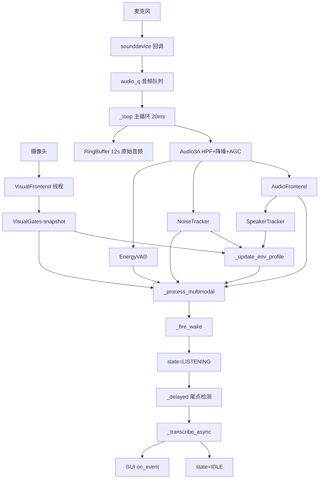

# Loona 唤醒模块工作流程

本文基于当前工程代码整理，覆盖音频采集、视频感知、多模态判定、环境画像、声纹聚类、唤醒后端点检测、ASR 转写、GUI 事件流以及最近几轮修复后的关键行为。

## 1. 总体流程图

## 2. 线程与模块分工

### 2.1 主线程 / GUI 线程
- 文件：wake_gui.py
- 作用：创建 Tk 窗口，启动 WakeDemo，接收 `on_event` 事件并刷新界面。
- 典型事件：`tick`、`wake`、`asr`、`state`、`env`。

### 2.2 音频回调线程
- 来源：sounddevice InputStream。
- 作用：把每个 20ms 音频块写入 `audio_q`。
- 特点：这里只做轻操作，避免阻塞底层音频驱动。

### 2.3 摄像头线程
- 文件：perception_visual.py
- 作用：持续抓取摄像头图像，检测人脸、注视、近场、唇动。
- 输出：`VisualGates` 快照，由主循环按需读取。

### 2.4 主循环线程
- 文件：wake_demo.py `_loop`
- 作用：整个识别链路的核心调度器。
- 流程：取队列帧 -> 写 ring -> 3A -> VAD/SNR/音频特征 -> 视觉快照 -> 环境画像 -> 多模态判定 -> 唤醒/ASR。

### 2.5 端点检测线程
- 文件：wake_demo.py `_on_wake -> _delayed`
- 作用：唤醒后等待用户说完，检测尾部静音并送 ASR。
- 特点：每 50ms 轮询一次最近 200ms 的 ring 音频 RMS。

### 2.6 ASR 线程
- 文件：wake_demo.py `_transcribe_async`
- 作用：异步做 ASR，避免阻塞主循环。
- 后端：优先 SenseVoice，失败时可回退 whisper。

## 3. 输入层实现

### 3.1 麦克风输入
- 使用 sounddevice 以 16kHz、int16、固定 blocksize 采样。
- 每帧长度是 `VAD_FRAME_LEN = 320`，对应 20ms。
- 多通道时可用于 GCC-PHAT 方向估计，单通道时只保留单声道特征。

### 3.2 摄像头输入
- 使用 OpenCV 打开摄像头。
- 持续产生当前帧的人脸框和视觉门限结果。

## 4. RingBuffer：原始音频缓存

### 实现方式
- 文件：wake_demo.py `RingBuffer`
- 固定长度循环数组，保存最近 `RING_SECONDS = 12` 秒原始 int16 PCM。
- 提供：
  - `write(data)`：写入最新音频。
  - `read_last(seconds, max_samples=None)`：读取最近一段音频。
  - `snapshot_total()`：读取累计写入样本数。

### 原理
- 环形缓冲避免频繁分配内存。
- 唤醒后可以回灌用户刚开口前的历史音频，避免截掉句首。
- 最近修复中引入 `total_written` + `_last_asr_end_sample`，用于隔离“上一次 ASR 已消费的样本”，解决下一次识别读到上一句内容的问题。

## 5. Audio3A：语音前处理

### 实现方式
- 文件：perception_audio.py
- 处理链：
  - 一阶高通滤波 HighPass1
  - 降噪（noisereduce 后端）
  - 温和增益控制

### 原理
- 高通用于去低频机械噪声。
- 降噪抑制空调、电扇等稳态背景噪声。
- 这里只影响 VAD 和特征提取，不直接送入 ASR；ASR 仍使用 ring 中原始音频，避免增强导致识别分布漂移。

## 6. EnergyVAD：轻量语音活动检测

### 实现方式
- 文件：wake_demo.py `EnergyVAD`
- 判定条件：
  - 当前帧 RMS 高于自适应噪声底一定 dB。
  - 过零率在语音合理区间内。

### 当前参数
- `energy_ratio_db = 5.0`
- `noise_floor = 40.0`
- ZCR 范围：`0.005 ~ 0.40`

### 原理
- RMS 表示能量，ZCR 辅助过滤纯脉冲噪声或异常低频噪声。
- 噪声底只在非语音时更新，防止说话时把门槛越抬越高。
- 这是一个极轻量 VAD，主要负责给后续更复杂的多模态逻辑提供基础语音证据。

## 7. NoiseTracker：噪声底与 SNR

### 实现方式
- 文件：wake_demo.py `NoiseTracker`
- 在非语音帧上做 EMA 更新，得到 `noise_rms`。
- 使用公式计算当前帧信噪比：

$$
SNR = 20 \log_{10}\left(\frac{rms + \epsilon}{noise\_rms + \epsilon}\right)
$$

### 原理
- 在办公、宿舍等场景中，噪声底会缓慢变化。
- 用自适应噪声底比固定阈值更稳健。
- SNR 被用于：硬门限、环境画像、仲裁器判断。

## 8. AudioFrontend：音频特征提取

### 实现方式
- 文件：perception_audio.py `AudioFrontend`
- 每帧输出 `AudioFeatures`：
  - `rms`
  - `is_voiced`
  - `spec_centroid`
  - `pitch_hz`
  - `doa_deg`
  - `near_field_ok`

### 关键判定
- `is_voiced = voicing >= voicing_min and pitch > 0 and rms > 50`
- `voicing_min = 0.20`
- `near_field_rms` 默认 350

### 原理
- `pitch_hz` 由短时周期性估计得到，适合捕捉浊音。
- `spec_centroid` 是频谱重心，可区分较亮/较闷的音色。
- `doa_deg` 用于估计声音方向。
- `near_field_ok` 用于判断说话人是否足够靠近麦克风。

## 9. VisualFrontend：视觉门限

### 实现方式
- 文件：perception_visual.py
- 输出 `VisualGates`，包含：
  - `face_present`
  - `face_count`
  - `gaze_aligned`
  - `near_field`
  - `lip_moving`
  - `face_area_ratio`
  - `lip_motion_std`

### 原理
- 人脸检测判断画面中是否有人。
- 人脸中心偏移量近似表征是否“正对设备”。
- 人脸面积比近似表征距离远近。
- 嘴部区域亮度/纹理变化的短时标准差近似表征唇动。

## 10. SpeakerTracker：轻量声纹聚类

### 实现方式
- 文件：wake_demo.py `SpeakerTracker`
- 不是重型声纹识别模型，而是基于每句语音的统计特征做说话人粗分群。
- 句子结束条件：连续约 400ms 静音。
- 每句提取：
  - `pitch_hz` 中位数
  - `spec_centroid` 中位数
- 与历史说话人模板比较：
  - 基频差换算为 semitone
  - 频谱重心差用 Hz 度量

### 主要参数
- `PITCH_TOL_ST = 2.5`
- `CENT_TOL_HZ = 500`
- `retention_s = 8.0`

### 原理
- 不同说话人的声带长度、共振腔体结构不同，导致基频和频谱重心存在统计差异。
- 这个模块不是为了精确身份认证，而是为了检测“短时间内是否出现了不止一位说话人”。
- 对工程目标来说，这个粒度已经足够驱动多人场景下的策略切换。

## 11. 环境画像 `_update_env_profile`

### 输入
- 噪声底
- 语音比例
- 摄像头中的人数分布
- 声纹聚类后的不同说话人数

### 输出
- `profile ∈ {relaxed, normal, strict}`
- 同时输出 `noise`、`crowd`、`speakers_distinct` 等快照字段

### 判定逻辑
- 安静 + 单人 -> `relaxed`
- 嘈杂 或 多人 -> `strict`
- 其他 -> `normal`
- 若 `speakers_distinct >= 2`，直接强制视为多人场景

### 原理
- 单人安静环境适合提高灵敏度。
- 多人或嘈杂环境需要减少误触发，因此切到更严格的门限组合。

## 12. `_process_multimodal`：多模态判定核心

### 输入证据
- 音频：`voiced`、`snr`、`speech_run`、`near_field`、`doa`
- 视频：`face`、`gaze`、`lip`
- 联合证据：`av_sync`

### `av_sync` 实现方式
- 维护最近约 1 秒的 `(voiced, lip_moving)` 滑窗。
- 统计：
  - `coincide`：有声且唇动的帧数
  - `voiced_cnt`
  - `lip_cnt`
  - `voiced_only`：有声但没唇动的反证帧
- 当前宽松条件：
  - `voiced_cnt >= 3`
  - `lip_cnt >= 3`
  - `coincide >= max(2, 0.35 * voiced_cnt)`
  - `voiced_only <= 1.8 * coincide + 2`

### 多人场景下的加强策略
当 `speakers_distinct >= 2` 且视觉可用时：
- `face` 收紧为“恰好只有一张脸”；
- `av_sync` 改为更严格的 500ms 规则：
  - 更高的共现比例
  - 更少的反证帧

### 原理
- 单纯有人说话不够，还要尽量确认是镜头前这位用户在说。
- 唇动和发声同步是最强的跨模态一致性证据之一。
- 多人场景中加强 face 和 av_sync，可以显著降低旁边其他人的干扰。

## 13. Profile 权重与仲裁

### 三档 profile
- `relaxed`
- `normal`
- `strict`

### 内容
每档定义：
- `required` 必须通过的门
- `weights` 可选加权项
- `optional_thresh`
- `sustain_frames`
- `debounce_s`

### 当前行为
- `strict` 模式下会更强调 gaze、doa、av_sync。
- 同时需要更多连续命中帧，且触发后防抖更长。

### 原理
- 不同环境下，统一门限会要么误触发太多，要么过于迟钝。
- profile 机制允许系统根据场景自动切换识别策略。

## 14. `_fire_wake` 与 LISTENING 状态

### 实现方式
- 触发后设置 `state = LISTENING`
- 记录 `listen_start`
- 发送 `wake` 事件给 GUI
- 拉起端点检测线程

### 最近修复
- 过去成功识别后会一直保持 LISTENING，直到超时才回 IDLE，导致下一句要等几秒。
- 现在在 ASR 成功完成后会立即切回 `IDLE`，可连续识别下一句。

## 15. 端点检测 `_delayed`

### 实现方式
- 唤醒后每 50ms 检查最近 200ms 的尾部 RMS。
- 条件：
  - 最少等待 `ENDPOINT_MIN_WAIT_MS = 250ms`
  - 连续静音达到 `ENDPOINT_SILENCE_MS = 500ms` 则认为说完
  - 最长等待 `POSTROLL_SECONDS = 6.0s`

### 原理
- 过早提交会截掉句尾。
- 等太久则影响响应速度。
- 这是典型的语音 endpointing 设计，在实时交互里非常常见。

## 16. `_prep_asr_audio`：ASR 前处理

### 实现方式
- 从 ring 读出历史音频后，做：
  - VAD 裁剪
  - 换气/短停顿容忍
  - RMS 归一化
- 不做预加重。

### 关键修复
- 过去最长只读 `REPLAY + POSTROLL`，长语音后半句容易丢。
- 现在读取 `REPLAY_SECONDS + 实际等待时长 + 裕量`，长句不会被硬截断。
- 静音容忍扩大到约 500ms，避免长句中途换气被裁成两段。

### 原理
- ASR 模型更适合连续、完整、幅度相对稳定的输入。
- 过强的前处理会破坏原始语音分布，因此这里只做保守增强。

## 17. `_transcribe_async`：ASR 异步识别

### 实现方式
- 优先 SenseVoice：`create_stream -> accept_waveform -> decode_stream`
- 失败时可回退 whisper
- 结果输出前做：
  - 文本合法性判断 `_asr_is_meaningless`
  - 标点清洗 `_strip_punct`

### 最近修复
- ASR 成功后立即 `state = IDLE`，解决识别后要等待几秒才能识别下一条的问题。
- 配合 `_last_asr_end_sample`，解决新一句输出成上一句文字的问题。

## 18. GUI 事件流

### 常见事件
- `started`：系统启动
- `tick`：每帧打点，GUI 更新门限状态与分数
- `env`：环境画像变化
- `wake`：发生一次唤醒
- `asr`：一次识别结果
- `state`：IDLE / LISTENING 状态切换

### 原理
- 算法与 UI 解耦。
- 主逻辑只负责 emit 结构化事件，GUI 只负责渲染。
- 这种方式对后续改成 WebSocket、HTTP 或机器人中间件都比较友好。

## 19. 当前工程的关键修复与行为变化总结

### 已落地的重要修复
1. 提高语音采集灵敏度：降低 VAD/SNR/voicing/near-field 门槛。
2. 识别成功后立即回 IDLE：解决要等几秒才能再次识别的问题。
3. RingBuffer 增加 ASR 边界隔离：解决下一条识别输出上一条文字的问题。
4. 延长 postroll + 动态读取历史：解决长语音后半段丢失的问题。
5. 增加 SpeakerTracker：检测短时间多人说话场景。
6. 多人场景下加强 face 与 av_sync：降低他人插话导致的误识别。

## 20. 一句话总结

当前工程是一个“音频主导、视觉校验、环境自适应、带轻量声纹聚类”的实时多模态唤醒与短句识别系统：
- 音频负责发现“有人在说话”；
- 视频负责确认“是不是镜头前这位在说”；
- 声纹聚类负责判断“最近是不是不止一个人在说”；
- 环境画像负责动态切换宽松或严格策略；
- 端点检测和 ASR 负责把一句完整的话可靠地送去转写。
